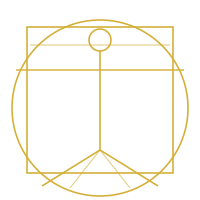

<div align="center">




<br/>

<a href="https://github.com/LoenardoDaCode">
  
</a>

<br/>

❦

<br/>


</div>

<br/>

> *"Simplicity is the ultimate sophistication."* — Leonardo da Vinci

<br/>

## ❦ &nbsp; From the Notebook

```yaml
name: Dmytro Tiaka
craft: Python Backend Developer & Full-Stack Engineer
experience: 5+ years
discipline:
  - Building APIs, automation systems & data pipelines — FastAPI / Django
  - Full-stack works — React, Next.js & TypeScript
  - Conversational automations (Telegram bots) & data-gathering engines (scraping)
workshop: Lviv, Ukraine
status: Open to new commissions 🕊️
```

<br/>

## ❦ &nbsp; Tools of the Workshop

<div align="center">

**Foundations — Backend**


<br/><br/>

**Automations & Raw Materials**


<br/><br/>

**Facade — Frontend**


<br/><br/>

**Scaffolding — Cloud & DevOps**


<br/><br/>

**Tools of the Trade**


</div>

<br/>

## ❦ &nbsp; Tongues of the Master


<br/>

## ❦ &nbsp; Correspondence

<div align="center">

[](mailto:dmytrotyaka@gmail.com)
[](https://linkedin.com/in/dmytro-tiaka-3d953b43b33/)

<br/>


</div>


<div align="center"><sub>Codex Tiaka · Anno Domini 2026 ❦</sub></div>
